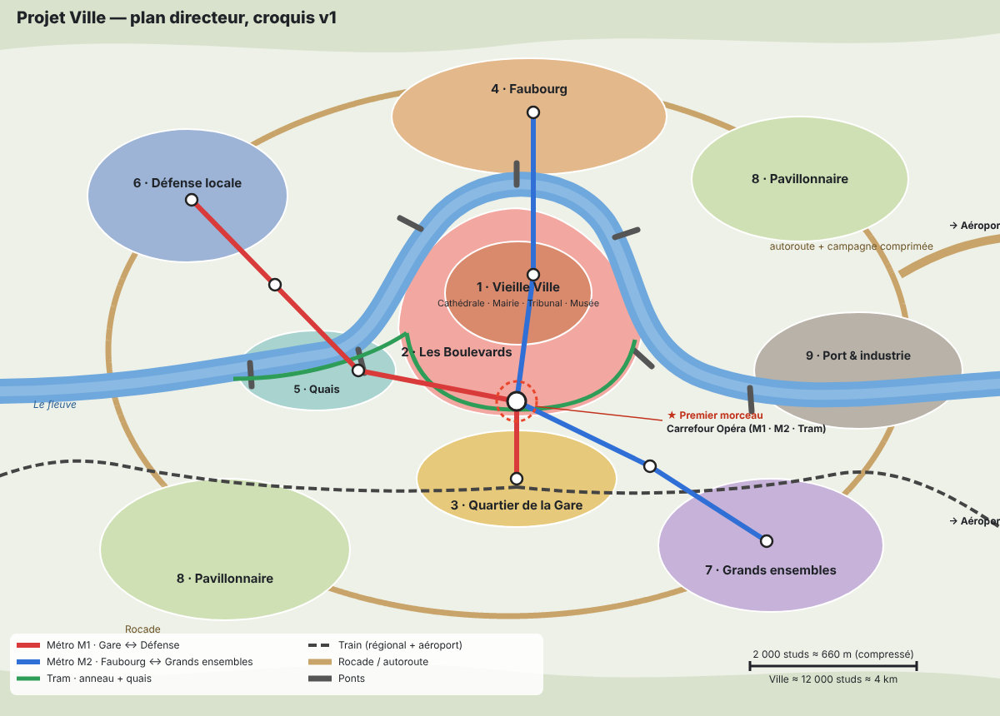

# 03 · Plan directeur

Croquis de principe validé (v1). Ce n'est pas encore un tracé à l'échelle : le plan rue par rue sera établi pendant le développement, quartier par quartier.

## Géographie

- **Fleuve en vallée**, d'ouest en est, formant une **grande boucle** vers le nord qui enserre la Vieille Ville (logique historique : défense naturelle, comme à Besançon).
- **Relief faible** : léger promontoire pour la Vieille Ville (silhouette de la ville vue des ponts) ; **quais bas et quais hauts** le long du fleuve (rampes, escaliers, promenade au bord de l'eau) ; collines lointaines hors zone jouable pour suggérer la vallée.
- Dimensions compressées : ville ≈ **12 000 studs ≈ 4 km** ; aéroport au-delà, à l'est, après une campagne comprimée.

## Les quartiers

| # | Quartier | Époque | Caractère | Lieux métiers |
|---|---|---|---|---|
| 1 | **Vieille Ville** | Moyen Âge | Promontoire dans la boucle, ruelles, cathédrale, place du marché | Mairie, tribunal, musée |
| 2 | **Les Boulevards** ⭐ | 1860-1900 | Anneau haussmannien sur l'ancien tracé des remparts, appuyé au fleuve à ses deux extrémités | Banque, poste, cinéma, cafés et brasseries |
| 3 | **Quartier de la Gare** | 1850-1930 | Gare monumentale hors de l'anneau, hôtels, pôle d'échange ; les voies forment une frontière au sud | Commissariat central |
| 4 | **Faubourg** | 1880-1930 | Rive nord, populaire, ateliers devenus lofts, marché couvert | Boîte de nuit, salle de sport |
| 5 | **Quais** | XIXe et années 2000 | Quais réaménagés, promenade, entrepôts reconvertis | Restaurants, parc |
| 6 | **Défense locale** | 1980-2026 | Ouest (amont), tours de bureaux, dalle piétonne, centre commercial | Supermarché ; hôpital à proximité |
| 7 | **Grands ensembles** | 1960-1975 | Sud-est, barres et tours, espaces verts | École, caserne de pompiers |
| 8 | **Pavillonnaire** | 1950-2026 | Sud-ouest et nord-est, maisons avec jardin | Écoles de quartier |
| 9 | **Port et industrie** | XXe siècle | Est (aval), port fluvial, entrepôts, logistique, friche ferroviaire ; **poste source électrique**, station d'épuration | Quais de livraison, entrepôts |
| ✈ | **Aéroport** | Contemporain | À l'est, au-delà de la rocade | Terminal explorable |

## Réseaux de transport

- **Routes** : radiales anciennes depuis la Vieille Ville ; **anneau des Boulevards** ; **rocade** ; **autoroute** vers l'aéroport avec de vrais échangeurs ; nombreux **ponts**.
- **Métro M1** : Gare ↔ Opéra ↔ Quais ↔ Défense locale.
- **Métro M2** : Faubourg ↔ Vieille Ville (Cathédrale) ↔ Opéra ↔ Grands ensembles.
- **Correspondance M1/M2 à Opéra.** 8 à 10 stations au total.
- **Tram** : tour de l'anneau des Boulevards + quais, sur chaussée partagée.
- **Trains** : depuis la Gare centrale, ligne vers l'aéroport à travers la campagne comprimée + tronçon régional vers l'ouest.

## Sous-sol (plan en volume)

Le sous-sol est planifié en couches, du haut vers le bas, pour éviter les conflits :

1. Caves d'immeubles.
2. Réseaux techniques : galeries, égouts (visitables), câbles, canalisations.
3. Parkings souterrains.
4. Métro (tunnels, stations, correspondances).

Chaque élément souterrain est réservé dans le plan directeur avant d'être construit.

## Premier morceau : la place de l'Opéra

- **Place rectangulaire** pavée : arbres d'alignement, bancs, kiosques, fontaine.
- **Grand Théâtre-Cinéma** sur le côté nord (conçu à la main) : façade monumentale, grand escalier, foyer, salle à balcons, cabine de projection, coulisses.
- **Boulevards** débouchant aux quatre angles ; **tram** longeant la place.
- **Quatre îlots haussmanniens partiels** (~12 à 16 immeubles) : cafés en terrasse, boutiques, une banque au rez-de-chaussée ; appartements aux étages ; chambres de bonne sous les toits ; cours intérieures ; caves ; toits praticables.
- **Station de métro Opéra** (correspondance M1/M2) : bouches d'entrée Art nouveau, salle des billets, couloirs, deux quais superposés.
- **Infrastructure visible** : transformateur de quartier, armoires de rue, regards, bouches d'incendie, antenne relais sur un toit, lampadaires sur circuits.
